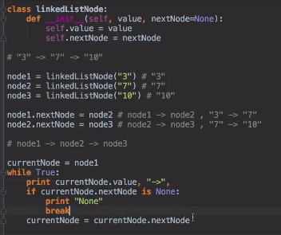

# A Little About Linked Lists

- Jason 
- Ghenet
- Nassima 
- Enrique

## What is a linked list?

A linked list is similar to, but not entirely like, an array in that data is structured linearally. Each element in the linked list is it's own object, similar to how each index in an array can hold a different value. Unlike arrays, each element, called a node, consists of two parts- the data the node carries, and a reference to the next node. The node are linked together link a chain until the last node, where the link refers to null instead. Also unlike arrays, data is inserted and accessed at the head, or beginning, of the list.

## What are some examples of linked lists?

- Code Example 

- Image galleries frequently make use of linked lists to naviage through all the images. A reference to the previous image is needed to find the next image until the end of the gallery.

- Web browsers create a linked list of web-pages visited, so that when you check history (traversal of a list) or press back button, the previous node's data is fetched.

## What kinds of problems can I solve/ask with linked lists?

Linked List manipulation is a common interview topic for junior web developers. It is a simple data structure that can shrink or expand on demand based on how much data is being inserted or removed. Additionally, the linear nature of the nodes and the fact that all nodes must be traversed to move across the linked list means that linked list problems runtimes are O(n). Many common interview questions are about accessing specific nodes in a Linked List.

## Common Interview questions with Linked Lists:

- Reverse a linked list
- Detect loop in a linked list
- Return Nth node from the end in a linked list
- Remove duplicates from a linked list

## Additional resources

- Carnegie Mellon University article about Linked Lists by Victor S. Adamchik, 2009 https://www.cs.cmu.edu/~adamchik/15-121/lectures/Linked%20Lists/linked%20lists.html

- freeCodeCamp Medium.com article about Linked Lists in Python https://medium.freecodecamp.org/python-interview-question-guide-how-to-code-a-linked-list-fd77cbbd367d

- Brief 2 minute explanation of Linked Lists (video) https://www.youtube.com/watch?v=jgp8eNQylq4